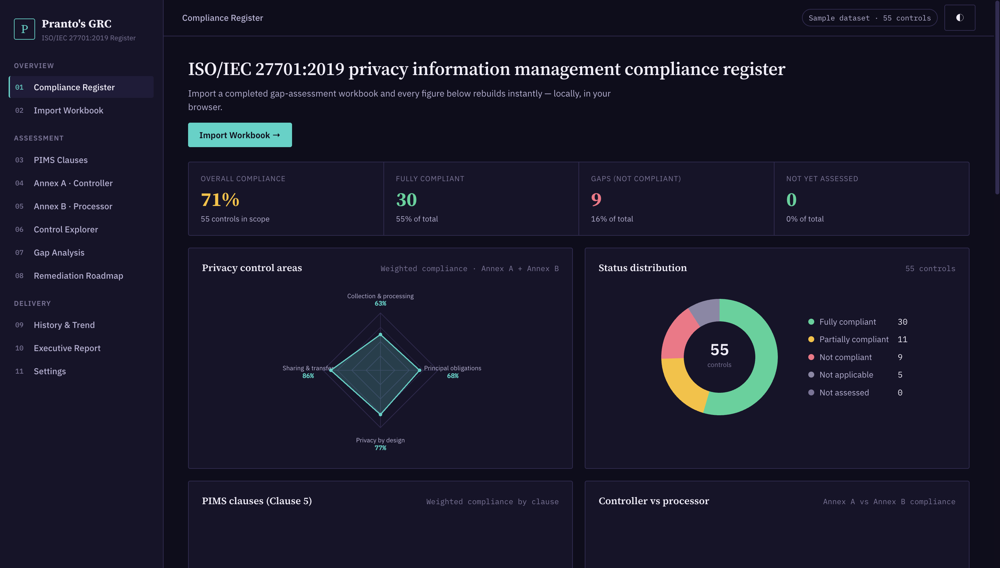
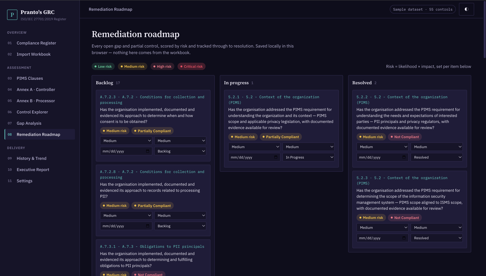
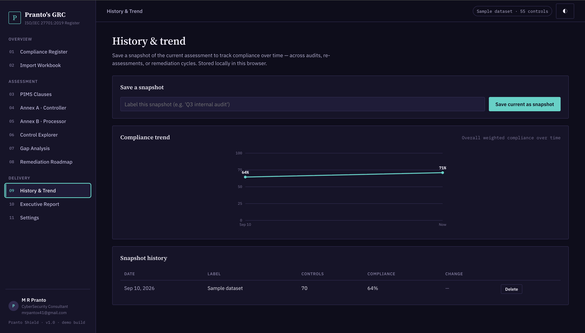

# Pranto Shield — ISO/IEC 27701:2019 Privacy Information Management Register

A single-page, dependency-light dashboard for tracking an ISO/IEC 27701:2019
Privacy Information Management System (PIMS) gap assessment: import a
workbook, and every chart, table, and report rebuilds instantly, entirely in
the browser.

Built as a portfolio piece with **plain HTML, CSS, and JavaScript** — no build
step, no framework, no backend.

Have a look : https://mizanpranto.github.io/ISO-IEC-27701-2019-privacy-information-management-compliance-register/





## Why ISO/IEC 27701

ISO/IEC 27701:2019 is a privacy extension bolted onto an existing ISO 27001
ISMS, not a standalone management system — and its shape reflects that. It
doesn't restate clauses 4–10; it adds a handful of privacy-specific
requirements at exactly six points (**5.2.1–5.2.4**, context and scope; and
**5.4.1.2–5.4.1.3**, risk assessment and treatment) and leaves the rest of
the ISMS clauses to apply unchanged. Its real substance is two parallel
Annexes reflecting the two roles an organisation can play under data
protection law: **Annex A** (31 controls) for organisations acting as a
**PII controller**, and **Annex B** (18 controls) for organisations acting
as a **PII processor** — many organisations need both. Both annexes share
the same four privacy areas: conditions for collection and processing,
obligations to PII principals, privacy by design and by default, and PII
sharing/transfer/disclosure.

Pranto Shield models this honestly rather than forcing it into the same
"clauses 4–10 + one Annex A" shape used for ISO 27001 and ISO 42001: the
PIMS Clauses view only shows the six items that actually add a requirement,
and Annex A and Annex B are tracked — and compared — separately.

## Features

- **Compliance register (dashboard)** — KPI summary, a 4-point radar across
  the shared privacy areas (combining Annex A + Annex B), a status donut, a
  Controller-vs-Processor compliance comparison, a full compliance matrix,
  and a "needs attention" table — all rendered with hand-rolled SVG, no
  charting library.
- **Import workbook** — drag-and-drop or browse for a `.xlsx` / `.xls` /
  `.csv` gap-assessment file. Headers are matched flexibly against a
  documented expected structure, with a parse log that flags blank
  references, duplicates, and unrecognised compliance values.
- **PIMS clauses / Annex A (Controller) / Annex B (Processor)** — three
  separate views reflecting the standard's real structure, each showing
  requirement, status, owner, priority, and notes.
- **Control explorer** — search/filter every clause and control across all
  three categories, with CSV export.
- **Gap analysis** — transparent, rule-based findings (weakest sections,
  unassessed controls, high-priority gaps). No external AI/LLM call is made
  — the logic is all in `js/app.js`.
- **Remediation roadmap** — every open gap becomes a Kanban card (Backlog /
  In Progress / Resolved), scored by likelihood × impact into a Low–Critical
  risk rating, with an assignable due date. Persisted in `localStorage`,
  independent of whatever workbook is currently loaded.
- **History & trend** — save timestamped snapshots of the assessment and
  watch overall compliance move over time on a line chart, with a
  point-to-point delta table.
- **Backup & restore** — export the full local state (dataset + roadmap +
  snapshot history) as one portable JSON file, and restore it later or on
  another machine.
- **Executive report** — a print-ready, one-page compliance summary
  (`window.print()` → Save as PDF).
- **Light / dark theme**, persisted with `localStorage`.

## Getting started

No build tooling required.

```bash
git clone <this-repo>
cd pranto-shield
python3 -m http.server 8080   # or any static file server
# open http://localhost:8080
```

You can also just open `index.html` directly in a browser — the only
network calls are two font/library CDNs (Google Fonts and SheetJS via
cdnjs); everything else, including all data processing, runs locally.

A ready-to-import example file is included at
`sample-data/iso27701-sample-assessment.csv`, or click **Load sample
assessment** on the Import Workbook screen.

## Project structure

```
index.html            Page shell + all views
css/styles.css         Design system & layout
js/catalog.js          Canonical ISO/IEC 27701:2019 clause & Annex A/B control list
js/data.js              Fictional demo dataset used for "Load sample assessment"
js/charts.js            Dependency-free SVG radar/donut/line chart helpers
js/app.js               State, parsing, rendering, roadmap, history, navigation
sample-data/            Downloadable example workbook (CSV)
```

## Workbook format

Pranto Shield looks for a sheet with these columns (flexible header
matching):

| Column | Notes |
|---|---|
| Category | `Mandatory Clauses`, `Annex A Controls`, or `Annex B Controls` |
| Section | e.g. `5.2 - Context of the organization (PIMS)`, `A.7.2 - Conditions for collection and processing` |
| Standard Ref | clause or control number, e.g. `5.4.1.2`, `A.7.4.5`, `B.8.5.3` |
| Assessment Question | the requirement text |
| Compliance | `Fully Compliant` / `Partially Compliant` / `Not Compliant` / `Not Applicable` |
| Notes, Owner, Priority | optional |

Any catalog control not present in the uploaded file is shown as **Not
Assessed** rather than being dropped — the register always reflects the full
6-clause / 31-control / 18-control ISO/IEC 27701:2019 structure. If your
organisation is only a controller or only a processor, leave the
not-applicable annex's rows marked `Not Applicable` in your workbook.

## What makes this more than a viewer

A gap-assessment dashboard that only ever reflects whatever file is loaded
right now is useful for a single review meeting and not much else. Pranto
Shield adds the two things a privacy/GRC team actually needs between
assessments:

- a place to **act** on gaps (the roadmap), with risk scoring so the list is
  triaged rather than flat, and
- a way to **prove progress** over time (snapshots + trend), so "we improved
  compliance from 61% to 84% over two quarters" is a chart, not a claim.

Both are backed by nothing more than `localStorage` and a JSON export, on
purpose — no server, no accounts, no lock-in.

## Notes

- This is an independent portfolio project inspired by the concept of
  browser-based ISO gap-assessment dashboards. It is not affiliated with
  ISO/IEC, and the bundled sample data is entirely fictional.
- Control and clause titles follow the published ISO/IEC 27701:2019
  numbering and short names for reference purposes; assessment question
  text is original wording, not reproduced from the standard.
- ISO/IEC 27701 was updated in 2025 with a restructured Annex A/B; this
  build models the 2019 edition, which remains the version most
  organisations are currently certified against.

## License

MIT — do whatever you like with it.
